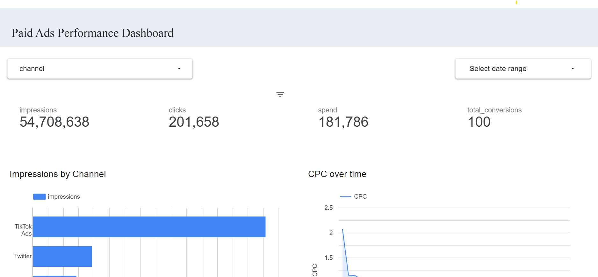

# Paid Ads Common Data Model Challenge

This project implements a **Marketing Common Data Model (MCDM)** for **Paid Ads Basic Performance** using **dbt + BigQuery**.  
It consolidates raw data from multiple ad platforms (Facebook, TikTok, Bing, Twitter) into a single unified table:  

**`mcdm_paid_ads_basic_performance`**

---

## 📊 Deliverables

- ✅ **dbt model**: `mcdm_paid_ads_basic_performance`  
- ✅ **Schema tests**: not-null checks on `channel`, `date`, `impressions`, `spend`  
- ✅ **Documentation**: generated via `dbt docs`  
- ✅ **Dashboard**: Looker Studio visualization connected to BigQuery  

🔗 **Dashboard link:** [View Looker Studio Dashboard](https://lookerstudio.google.com/reporting/10aa7474-88da-4d10-bb5c-0bdc9a671968)  

(Optional) 

---

## 🚀 How to Run Locally

### 1. Install dbt BigQuery
```bash
pip install dbt-bigquery
```

### 2. Configure dbt Profile
Add this to your ~/.dbt/profiles.yml (or use .dbt/profiles.yml in repo):

```yaml
paid_ads_mcdm:
  target: dev
  outputs:
	dev:
	  type: bigquery
	  method: service-account
	  project: gcp_project_name
	  dataset: your_dataset_name
	  keyfile: <Path_to_your_key_file> 
	  threads: 4
	  timeout_seconds: 300
	  location: US
```

### 3. Run the Pipeline
```bash
dbt seed --full-refresh
dbt run
dbt test
```

### 4. View Documentation
```bash
dbt docs generate --profiles-dir .dbt
dbt docs serve --profiles-dir .dbt
```
Docs will be available at http://localhost:8080.

---

## 📖 Adding a New Platform
See INSTRUCTIONS.md for detailed steps on extending the MCDM with additional ad platforms.

---

## 🧩 Project Structure
```pgsql
.
├── models/
│   └── mcdm/
│       ├── mcdm_paid_ads_basic_performance.sql
│       └── schema.yml
├── seeds/
│   ├── src_ads_bing_all_data.csv
│   ├── src_ads_creative_facebook_all_data.csv
│   ├── src_ads_tiktok_ads_all_data.csv
│   └── src_promoted_tweets_twitter_all_data.csv
├── .dbt/
│   └── paid-adds-challenge-credentials.json
├── INSTRUCTIONS.md
└── README.md
```

---

## 🏁 Next Steps
- Add new raw datasets into seeds/
- Extend the model with UNION ALL for each platform
- Run dbt test to validate
- Refresh dashboard in Looker Studio
